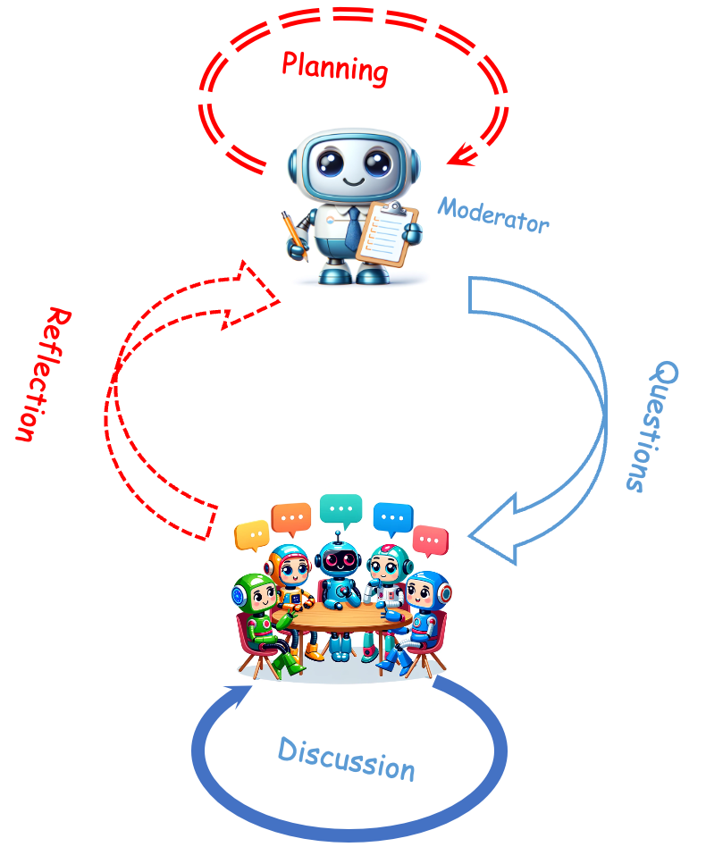
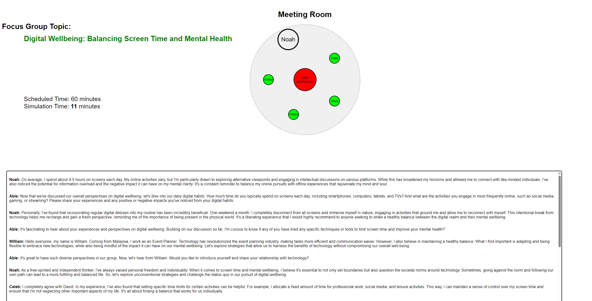
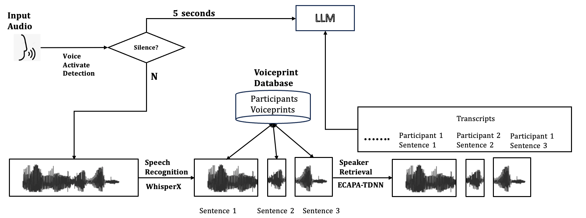
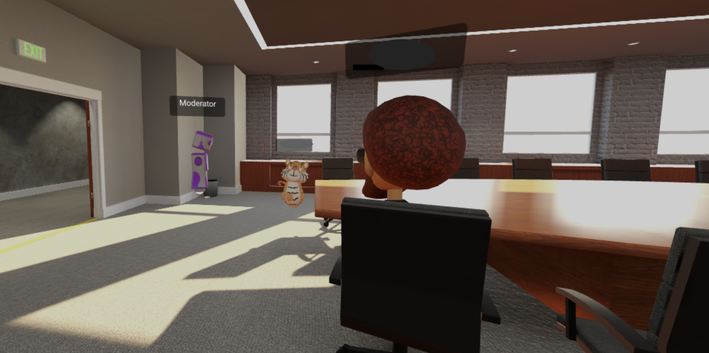

<h1 align="center">Focus Agent</h1>

<p align="center">
  <a href="https://github.com/AriaXR/FocusAgent/blob/main/LICENSE">
        
  </a>

  <a href="https://arxiv.org/abs/2409.01907">
        
  </a>

  <a href="https://aria.cs.kuleuven.be">
  	
  </a>

<table style="width:100%; border-collapse: collapse; border: 0;">
<tr style="border: none;">
<td style="width:60%; border: 0; vertical-align: middle; font-size: 14px;">

<p style="font-size: 16px;">
	This is the official implementation of the paper <strong><em>“Focus Agent: LLM-Powered Virtual Focus Group”</em></strong> for IVA24. Focus Agent is a voice-based system designed to simulate focus group discussions or to guide human participants in a focus group as a moderator. This repo includes two parts of codes:  

 - ⚡️ Web Demo for Focus Group Simulation  
 - 🗣️ Online Focus Group System with AI Moderator

</td>
<td style="width:40%; border: 0; text-align: right; vertical-align: middle;">



</td>
</tr>
</table>

# Simulation
First, step into the directory  

    cd simulation  

    mkdir plan

    mkdir transcripts
    
  ## Environment
  Windows 11  
  python > 3.10  
  Install python environment  

    pip install -r env.txt       
  

  ## Change the API Keys before running
  find the codes in app.py and change the parameters in   
  
      simulator = ChatProcessor(meeting_info, api_key='Your OpenAI API Key', organization="Your OpenAI Organization", moderator_name = 'Moderator Name', model_name = "Model Name")  

      
  change the information according to [OpenAI Webset](https://platform.openai.com/docs/concepts)


  ## run WebDemo:  
  2. `python app.py`

 ## Example

 


# Moderator
 ## Dependency
 python > 3.10  
 Ram > 16GB  
 GPU RAM > 8GB (For Speech to Text)  

## Speech to Text



This S2T system is based on [Whsper-X](https://github.com/m-bain/whisperX/blob/main).


 ## run 
 ```

 ```

 ## Example
 

	
This original work is based on Mozilla Hub, which ended its support this year. It can easily be transferred to any other online meeting platform by monitoring the microphone and headphones through the system and changing the input from codes.

 # Contact and Support 

 Contact taiyu.zhang@kuleuven.be for queries.


 


